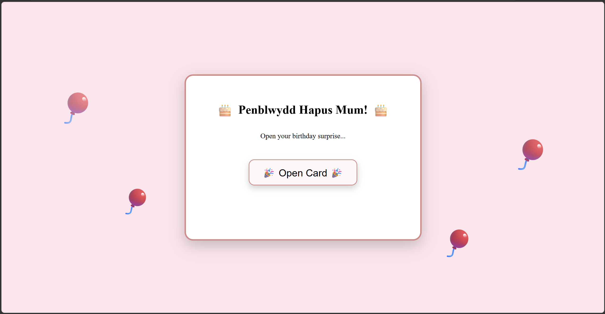
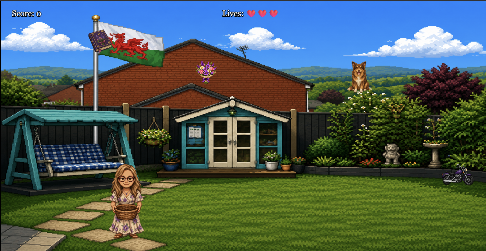
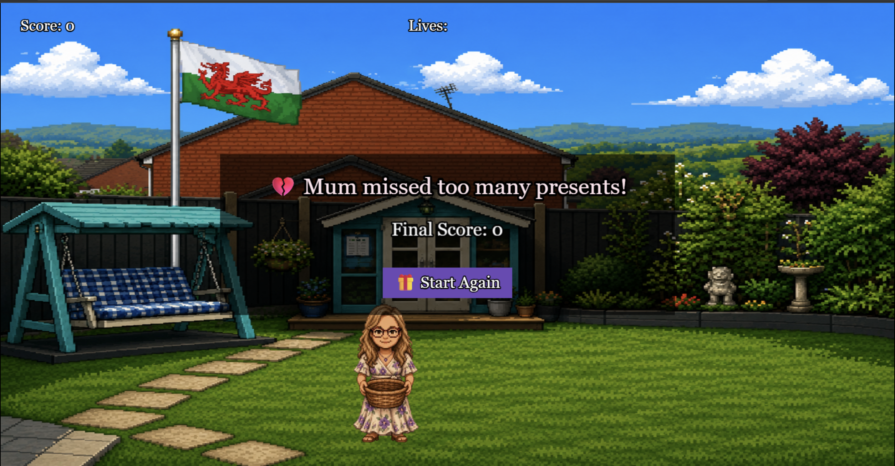

# 🎂 Birthday Quest 🎂

A fun pixel-art birthday game I created as a surprise for my mum.

The game is inspired by her favourite things, our family garden, and the little details that make it feel personal. Players control a pixel version of my mum, collecting the things she loves while trying not to miss too many presents.

It was designed as an interactive birthday card rather than a traditional game, combining a playful UI, animations, and a simple arcade-style experience.

---

## Features

- Animated birthday card opening screen
- Floating balloons and party popper effects
- Simple arcade gameplay
- Collect multiple birthday gifts
- Three lives system
- Increasing difficulty as your score grows
- Restart button after game over
- Mobile-friendly touch controls (drag to move)
- Keyboard controls on desktop
- Custom pixel-art garden inspired by our real garden

---

## 🎮 Gameplay 🎮

### Gameplay Demo

[Watch the gameplay demo](assets/birthday-quest-demo.gif)

### Opening Screen



### In Game



### Game Over



### Instructions 

- Move left and right to catch falling gifts.
- Every gift collected increases your score.
- Missing an item costs one life.
- Lose all three lives and the game ends.
- Try to beat your highest score!

---

## Built With

- HTML5
- CSS3
- JavaScript (ES6)
- Phaser 3 Game Framework

---

## Assets

Custom pixel artwork created specifically for this project, including:

- Pixel recreation of our family garden
- Pixel character based on my mum
- Custom birthday-themed collectables (including our family dog Leo)
- Birthday card interface
- Animated UI effects

---

## Controls

### Desktop

- ← Move Left
- → Move Right

### Mobile

- Drag your finger left and right across the screen to move the character.

---

## Running Locally

Clone the repository:

```bash
git clone https://github.com/belle-wills/birthday-quest.git
```

Open the project folder and run a local web server.

For example with VS Code Live Server:

```
Right Click → Open with Live Server
```

or

```bash
npx serve
```

---

## Inspiration

This project was created as a birthday gift for my mum.

Rather than buying a traditional card, I wanted to create something interactive that reflected her personality. The entire experience—from the animated birthday card to the pixel-art garden and gameplay—is based on things she loves, making it a unique and personal birthday surprise.

---

Made with ❤️ for Mum.
